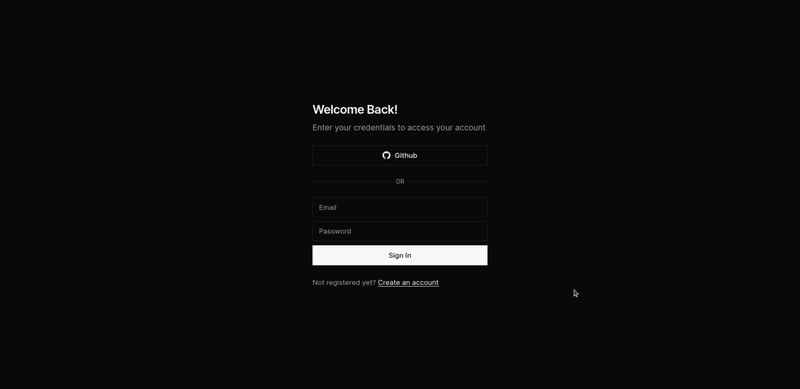

# Store CMS

> A Content Management System designed for managing online stores.

Store CMS is a user-friendly Content Management System for managing multiple stores. It provides essential features for handling products, categories, and storefronts efficiently.



<div>
    <a href="https://store-cms-rho.vercel.app/">View Demo</a>
    ·
    <a href="https://github.com/ayyyub777/store-cms/issues">Report Bug</a>
    ·
    <a href="https://github.com/ayyyub777/store-cms/issues">Request Feature</a>
  </p>
</div>

<details>
  <summary>Table of Contents</summary>
  <ol>
    <li>
      <a href="#tech-stack">Tech Stack</a>
    </li>
        <li>
      <a href="#key-features">Key Features</a>
    </li>
    <li>
      <a href="#development-setup">Development Setup</a>
      <ul>
        <li><a href="#prerequisites">Prerequisites</a></li>
        <li><a href="#steps">Steps</a></li>
      </ul>
    </li>
    <li><a href="#project-structure">Project Structure</a></li>
    <li><a href="#meta">Meta</a></li>
  </ol>
</details>

## Tech Stack

This project was developed using Next.js 14, Typescript, and Prisma. It incorporates Shadcn/ui components and utilizes Tailwind for the frontend.

[](https://skillicons.dev)

## Key Features

- **Authentication:**

  - Secure login system for authorized access.
  - Integrated third-party authentication for a streamlined sign-up and login experience.

- **Multi-Vendor Support:**
  Manage different stores with individually generated API routes.

- **Category & Product Management:**

  - Easily create, update, and delete product categories.
  - Simple CRUD operations for products, including multiple images.

- **Filter & Billboard Control:**

  - Customize filters like "Color" and "Size."
  - Manage text billboards attached to categories or standalone.

- **Search & Pagination:**

  - Quick search across categories, products, and more.
  - Pagination for smoother navigation.

- **Featured Products:**
  Highlight products on the homepage with the "featured" option.

- **ORM Integration:**
  Integration with Prisma for database operations.

## Development Setup

Follow these steps to set up the project locally on your machine.

### Prerequisites

Make sure you have the following installed on your machine:

- [Git](https://git-scm.com/)
- [Node.js](https://nodejs.org/en)
- [npm](https://www.npmjs.com/) (Node Package Manager)

### Steps

Clone the repository

```bash
git clone https://github.com/ayyyub777/store-cms.git
```

Install the project dependencies using npm

```bash
npm install
```

Create a new file named `.env` in the root of your project and add the following content:

```env
DATABASE_URL=
NEXTAUTH_URL=
NEXTAUTH_SECRET=
GITHUB_ID=
GITHUB_SECRET=
NEXT_PUBLIC_CLOUDINARY_CLOUD_NAME=
CLOUDINARY_URL=
```

Generate typings and apply schema

```bash
npx prisma generate
npx prisma db push
```

Run the project

```bash
npm run dev
```

Open [http://localhost:3000](http://localhost:3000) in your browser to view the project.

## Project Structure

```bash
├── .eslintrc.json
├── .gitignore
├── README.md
├── actions
│   └── getStats.ts
├── app
│   ├── [storeId]
│   │   ├── (routes)
│   │   │   ├── (overview)
│   │   │   │   ├── components
│   │   │   │   │   ├── api-item.tsx
│   │   │   │   │   ├── api-list.tsx
│   │   │   │   │   └── stats.tsx
│   │   │   │   └── page.tsx
│   │   │   ├── billboards
│   │   │   │   ├── [billboardId]
│   │   │   │   │   ├── components
│   │   │   │   │   │   └── billboard-form.tsx
│   │   │   │   │   └── page.tsx
│   │   │   │   ├── components
│   │   │   │   │   ├── cell-action.tsx
│   │   │   │   │   ├── client.tsx
│   │   │   │   │   └── columns.tsx
│   │   │   │   └── page.tsx
│   │   │   ├── categories
│   │   │   │   ├── [categoryId]
│   │   │   │   │   ├── components
│   │   │   │   │   │   └── category-form.tsx
│   │   │   │   │   └── page.tsx
│   │   │   │   ├── components
│   │   │   │   │   ├── cell-action.tsx
│   │   │   │   │   ├── client.tsx
│   │   │   │   │   └── columns.tsx
│   │   │   │   └── page.tsx
│   │   │   ├── colors
│   │   │   │   ├── [colorId]
│   │   │   │   │   ├── components
│   │   │   │   │   │   └── color-form.tsx
│   │   │   │   │   └── page.tsx
│   │   │   │   ├── components
│   │   │   │   │   ├── cell-action.tsx
│   │   │   │   │   ├── client.tsx
│   │   │   │   │   └── columns.tsx
│   │   │   │   └── page.tsx
│   │   │   ├── products
│   │   │   │   ├── [productId]
│   │   │   │   │   ├── components
│   │   │   │   │   │   └── product-form.tsx
│   │   │   │   │   └── page.tsx
│   │   │   │   ├── components
│   │   │   │   │   ├── cell-action.tsx
│   │   │   │   │   ├── client.tsx
│   │   │   │   │   └── columns.tsx
│   │   │   │   └── page.tsx
│   │   │   ├── settings
│   │   │   │   ├── components
│   │   │   │   │   └── store-details-form.tsx
│   │   │   │   └── page.tsx
│   │   │   └── sizes
│   │   │       ├── [sizeId]
│   │   │       │   ├── components
│   │   │       │   │   └── size-form.tsx
│   │   │       │   └── page.tsx
│   │   │       ├── components
│   │   │       │   ├── cell-action.tsx
│   │   │       │   ├── client.tsx
│   │   │       │   └── columns.tsx
│   │   │       └── page.tsx
│   │   ├── components
│   │   │   ├── logout.tsx
│   │   │   ├── main-nav.tsx
│   │   │   ├── routes.tsx
│   │   │   ├── search.tsx
│   │   │   ├── sidebar.tsx
│   │   │   ├── store-switcher.tsx
│   │   │   └── user-nav.tsx
│   │   └── layout.tsx
│   ├── api
│   │   ├── [storeId]
│   │   │   ├── billboards
│   │   │   │   ├── [billboardId]
│   │   │   │   │   └── route.ts
│   │   │   │   └── route.ts
│   │   │   ├── categories
│   │   │   │   ├── [categoryId]
│   │   │   │   │   └── route.ts
│   │   │   │   └── route.ts
│   │   │   ├── colors
│   │   │   │   ├── [colorId]
│   │   │   │   │   └── route.ts
│   │   │   │   └── route.ts
│   │   │   ├── products
│   │   │   │   ├── [productId]
│   │   │   │   │   └── route.ts
│   │   │   │   └── route.ts
│   │   │   └── sizes
│   │   │       ├── [sizeId]
│   │   │       │   └── route.ts
│   │   │       └── route.ts
│   │   ├── auth
│   │   │   └── [...nextauth]
│   │   │       ├── options.ts
│   │   │       └── route.ts
│   │   ├── register
│   │   │   └── route.ts
│   │   └── stores
│   │       ├── [storeId]
│   │       │   └── route.ts
│   │       └── route.ts
│   ├── auth
│   │   ├── layout.tsx
│   │   ├── register
│   │   │   ├── components
│   │   │   │   └── register-form.tsx
│   │   │   └── page.tsx
│   │   ├── setup
│   │   │   ├── components
│   │   │   │   └── store-form.tsx
│   │   │   └── page.tsx
│   │   └── signin
│   │       ├── components
│   │       │   └── signin-form.tsx
│   │       └── page.tsx
│   ├── favicon.ico
│   ├── globals.css
│   ├── layout.tsx
│   └── page.tsx
├── components.json
├── components
│   ├── icons.tsx
│   ├── modals
│   │   ├── alert-modal.tsx
│   │   └── store-modal.tsx
│   └── ui
│       ├── alert.tsx
│       ├── avatar.tsx
│       ├── badge.tsx
│       ├── button.tsx
│       ├── card.tsx
│       ├── checkbox.tsx
│       ├── command.tsx
│       ├── data-table.tsx
│       ├── dialog.tsx
│       ├── dropdown-menu.tsx
│       ├── form.tsx
│       ├── heading.tsx
│       ├── image-upload.tsx
│       ├── input.tsx
│       ├── label.tsx
│       ├── loader.tsx
│       ├── menubar.tsx
│       ├── modal.tsx
│       ├── popover.tsx
│       ├── scroll-area.tsx
│       ├── select.tsx
│       ├── separator.tsx
│       ├── table.tsx
│       ├── toast.tsx
│       ├── toaster.tsx
│       └── use-toast.ts
├── hooks
│   ├── use-category-modal.tsx
│   ├── use-origin.tsx
│   └── use-store-modal.tsx
├── lib
│   ├── prisma.ts
│   └── utils.ts
├── next.config.js
├── package-lock.json
├── package.json
├── postcss.config.js
├── prisma
│   └── schema.prisma
├── providers
│   ├── auth-provider.tsx
│   └── modal-provider.tsx
├── public
│   ├── next.svg
│   ├── style.png
│   └── vercel.svg
├── tailwind.config.js
├── tailwind.config.ts
├── tsconfig.json
├── types
│   └── next-auth.d.ts
└── utils
    └── formatting.js
```

## Meta

Ayoub Bigharassine – [LinkedIn](https://www.linkedin.com/in/ayoub-bigharassine/) – ayoub.bigharassine@gmail.com

Distributed under the MIT license. See `LICENSE` for more information.

[https://github.com/ayyyub777/store-cms](https://github.com/ayyyub777/store-cms/)
